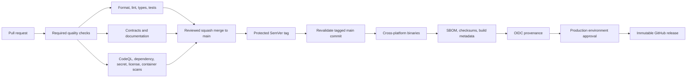

# CI/CD

Pull requests cannot enter the publication path. The production environment is
the explicit approval boundary, and release artifacts remain traceable to their
tag, source commit, workflow run, checksum, SBOM, and provenance attestation.
