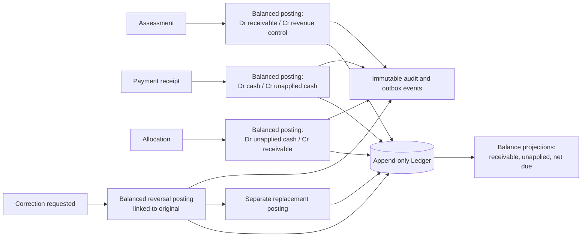

# Ledger posting flow

```mermaid
flowchart LR
  A[Assessment] --> AP["Balanced posting:<br/>Dr receivable / Cr revenue control"]
  P[Payment receipt] --> RP["Balanced posting:<br/>Dr cash / Cr unapplied cash"]
  AL[Allocation] --> LP["Balanced posting:<br/>Dr unapplied cash / Cr receivable"]
  AP --> L[(Append-only Ledger)]
  RP --> L
  LP --> L
  L --> B["Balance projections:<br/>receivable, unapplied, net due"]
  E[Correction requested] --> R["Balanced reversal posting<br/>linked to original"]
  R --> L
  R --> N[Separate replacement posting]
  N --> L
  AP --> U[Immutable audit and outbox events]
  RP --> U
  LP --> U
  R --> U
```
