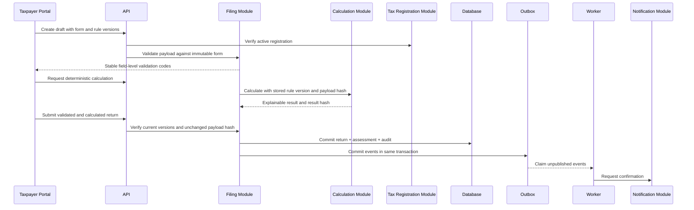

# Tax-return submission

```mermaid
sequenceDiagram
  participant Portal as Taxpayer Portal
  participant API
  participant Filing as Filing Module
  participant Calc as Calculation Module
  participant Reg as Tax Registration Module
  participant DB as Database
  participant Outbox
  participant Worker
  participant Notify as Notification Module
  Portal->>API: Create draft with form and rule versions
  API->>Reg: Verify active registration
  API->>Filing: Validate payload against immutable form
  Filing-->>Portal: Stable field-level validation codes
  Portal->>API: Request deterministic calculation
  Filing->>Calc: Calculate with stored rule version and payload hash
  Calc-->>Filing: Explainable result and result hash
  Portal->>API: Submit validated and calculated return
  API->>Filing: Verify current versions and unchanged payload hash
  Filing->>DB: Commit return + assessment + audit
  Filing->>Outbox: Commit events in same transaction
  Outbox-->>Worker: Claim unpublished events
  Worker->>Notify: Request confirmation
```
