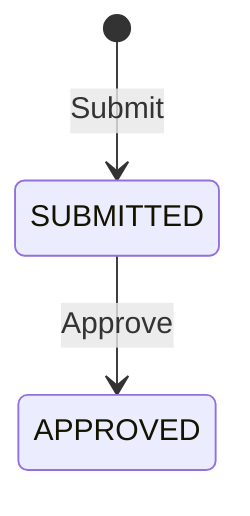

# Tax registration

The tax-registration context owns enrollment of a taxpayer in a tax type.
Submission requires an existing taxpayer in the same tenant and jurisdiction.
Approval is a separate authorized command.

Only a submitted registration can be approved; repeated or out-of-order
approval attempts fail with a conflict. Filing operations accept only approved
registrations. Submission and approval emit versioned integration events and
immutable audit events containing tenant, jurisdiction, actor, correlation, and
causation context.

Persistence is accessed through context-local repository interfaces. A module
must not read the taxpayer or registration schema directly from another bounded
context.
